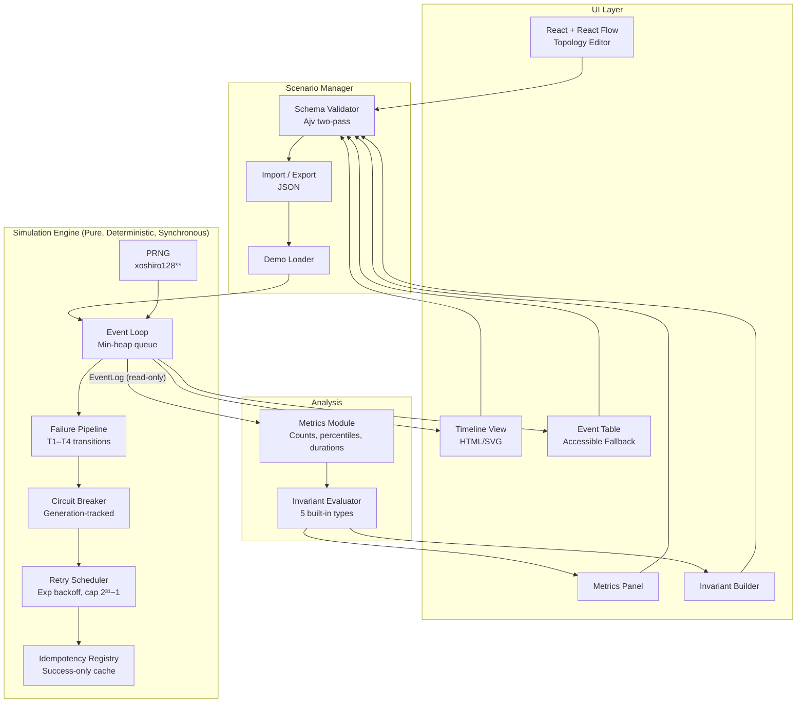

# Faultline

**Browser-based, zero-install, deterministic distributed-systems failure simulator.**

[](LICENSE)
[](tsconfig.json)
[](#accessibility)
[](#bundle-budget)

Faultline lets you model a service topology, inject failures (latency, lost responses, errors, network duplication), enable resilience patterns (retries, idempotency, circuit breakers), and replay the **identical scenario** to prove correctness invariants — all in your browser, with zero setup.

> **This is NOT an AI wrapper.** Faultline is a pure, deterministic simulation engine with a React UI. Same seed + same scenario = identical event sequence across browsers, operating systems, and runtimes.

🔗 **[Live Demo](https://taofiqq.github.io/faultline/)** · [Specification](.kiro/specs/faultline-core/) · [Payment Demo Walkthrough](docs/payment-demo-walkthrough.md)

---

## Table of Contents

- [Why Faultline](#why-faultline)
- [Key Features](#key-features)
- [Quick Start](#quick-start)
- [The Payment Double-Charge Demo](#the-payment-double-charge-demo)
- [Architecture](#architecture)
- [Engine Design](#engine-design)
- [Technology Stack](#technology-stack)
- [Development](#development)
- [Testing Strategy](#testing-strategy)
- [Browser Support](#browser-support)
- [Accessibility](#accessibility)
- [Bundle Budget](#bundle-budget)
- [Limitations (v1)](#limitations-v1)
- [Project Structure](#project-structure)
- [Documentation](#documentation)
- [License](#license)

---

## Why Faultline

Developers building distributed systems lack a fast, deterministic way to visualize how failures cascade through service topologies and whether resilience patterns actually protect correctness. Existing tools either require production infrastructure, introduce non-determinism, or can't prove invariants.

Faultline provides:

- **Deterministic replay** — reproduce any failure scenario exactly, every time
- **Instant feedback** — simulate 100 in-flight requests × 3 retries in < 2 seconds
- **Provable correctness** — 5 built-in invariant types with automated pass/fail evaluation
- **Zero install** — runs entirely in the browser, no backend required

---

## Key Features

| Feature                     | Description                                                                |
| --------------------------- | -------------------------------------------------------------------------- |
| 🎲 **Deterministic Engine** | xoshiro128** PRNG ensures identical results across runs, browsers, and OS  |
| 💥 **Failure Injection**    | Latency, lost responses, service errors, network duplication               |
| 🔄 **Resilience Patterns**  | Retries (exponential backoff + jitter), idempotency keys, circuit breakers |
| ✅ **Invariant Checking**   | 5 built-in types for automated correctness verification                    |
| 🖥️ **Visual Topology**      | React Flow drag-and-drop service graph editor                              |
| 📊 **Timeline View**        | HTML/SVG swim-lane visualization of event flow                             |
| ♿ **Accessible**           | WCAG 2.1 AA compliant; keyboard-navigable; screen-reader friendly          |
| 📦 **Lightweight**          | ≤ 500 KB gzip total bundle                                                 |
| 🧪 **Battle-tested**        | 90%+ branch coverage on engine and invariants                              |

---

## Quick Start

**Prerequisites:** Node.js >= 22.13.0

```bash
# Clone the repository
git clone git@github.com:Taofiqq/faultline.git
cd faultline

# Install dependencies
npm install

# Start development server
npm run dev
```

Open [http://localhost:5173](http://localhost:5173) and click **"Load Payment Demo"** to see Faultline in action.

---

## The Payment Double-Charge Demo

The canonical demonstration proves how idempotency prevents duplicate charges in under 30 seconds:

```
Client → API Gateway → Payment Service → Bank
```

| Step | Action                                | Result                                                                             |
| ---- | ------------------------------------- | ---------------------------------------------------------------------------------- |
| 1    | Load demo                             | Topology appears: API Gateway → Payment Service                                    |
| 2    | Run simulation                        | Response is lost, retry causes double charge — invariant `charge ≤ 1` **FAILS** ❌ |
| 3    | Toggle idempotency on Payment Service | Enables success-only response caching                                              |
| 4    | Re-run with same seed                 | Deduplication prevents double charge — invariant **PASSES** ✅                     |

**Time-to-insight: < 30 seconds from page load.**

The timeline view shows the deduplicated request and the circuit that prevented the second charge.

→ [Full Payment Demo Walkthrough](docs/payment-demo-walkthrough.md)

---

## Architecture



### Architectural Rules

- **Engine is pure** — zero browser/DOM dependencies; runs identically in Node.js and all supported browsers
- **Engine is synchronous** — no `async`, no `Promise`, no callbacks
- **UI never mutates EventLog** — consumed read-only after simulation completes
- **Validation is the boundary** — invalid scenario drafts never reach the engine
- **Single PRNG stream** — all randomness consumed in event-processing (FIFO) order

### Forbidden APIs in Engine (`src/engine/`)

| Forbidden                     | Reason                        |
| ----------------------------- | ----------------------------- |
| `Math.random()`               | Non-deterministic             |
| `Date.now()` / `new Date()`   | Wall-clock dependent          |
| `performance.now()`           | Wall-clock dependent          |
| `setTimeout` / `setInterval`  | Async scheduling              |
| `crypto.getRandomValues()`    | Non-deterministic             |
| `Promise` / `async` / `await` | Non-deterministic ordering    |
| Any DOM API                   | Browser-specific side-effects |

Enforced via ESLint `no-restricted-globals` and `no-restricted-syntax` rules.

---

## Engine Design

### Components

| Component                | Role                                                                     |
| ------------------------ | ------------------------------------------------------------------------ |
| **PRNG**                 | xoshiro128** with `Uint32Array(4)` state, `Math.imul` + `>>> 0`          |
| **Event Loop**           | Min-heap keyed by `(timestamp, sequence)` — FIFO at same timestamp       |
| **Failure Pipeline**     | Multi-event transitions T1–T4 modeling progressive failure               |
| **Circuit Breaker**      | Per-path state machine with generation tracking; stale responses ignored |
| **Retry Scheduler**      | Exponential backoff with jitter; delay capped at 2³¹−1 ms                |
| **Idempotency Registry** | Caches successful responses only; errors trigger fresh processing        |

### Determinism Contract

```
Same seed + Same scenario = Identical normalized event sequence
```

- Normalized = sorted by `(timestamp, sequence)`, compared via deep-equality
- Holds across runs, browsers (Chromium, Firefox, WebKit), and operating systems
- Verified by golden-file tests in CI (Node.js + headless Chromium)

### Safety Limits

| Limit               | Default   | Behavior                                      |
| ------------------- | --------- | --------------------------------------------- |
| Max simulation time | 60,000 ms | `SimulationStopped { reason: 'time-limit' }`  |
| Max events          | 100,000   | `SimulationStopped { reason: 'event-limit' }` |

---

## Technology Stack

| Layer               | Technology                              | Version                    |
| ------------------- | --------------------------------------- | -------------------------- |
| Language            | TypeScript (strict mode)                | Latest stable              |
| Build               | Vite                                    | Latest stable              |
| UI Framework        | React 19                                | Latest stable              |
| Topology Editor     | React Flow (`@xyflow/react`)            | Latest stable              |
| Schema Validation   | Ajv (JSON Schema draft-07, tree-shaken) | Pinned                     |
| PRNG                | Custom xoshiro128**                     | Internal (no external dep) |
| Unit/Property Tests | Vitest + fast-check                     | Latest stable              |
| E2E Tests           | Playwright                              | Latest stable              |
| Coverage            | Vitest v8 provider                      | —                          |

---

## Development

### Prerequisites

- Node.js >= 22.13.0
- npm (included with Node.js)

### Commands

| Command                 | Description                                      |
| ----------------------- | ------------------------------------------------ |
| `npm run dev`           | Start Vite dev server with HMR                   |
| `npm run build`         | Typecheck + production build                     |
| `npm run test`          | Run all unit, property, and golden-file tests    |
| `npm run test:coverage` | Generate coverage report (v8 provider)           |
| `npm run lint`          | ESLint (includes forbidden-API rules for engine) |
| `npm run format:check`  | Prettier format check                            |
| `npm run typecheck`     | `tsc --noEmit`                                   |
| `npx playwright test`   | E2E tests across Chromium, Firefox, WebKit       |

### CI Pipeline

```
lint (ESLint + forbidden-API rules)
  → typecheck (tsc --noEmit)
  → unit + property tests (Vitest)
  → coverage check (≥ 90% engine/invariants)
  → golden-file tests (Node + Chromium)
  → build (vite build)
  → bundle size check (≤ 500 KB gzip)
  → E2E tests (Playwright: Chromium, Firefox, WebKit)
  → accessibility audit (axe-core)
```

---

## Testing Strategy

### Unit Tests (Vitest)

Every module in `src/engine/`, `src/scenario/`, `src/metrics/`, and `src/invariants/` has a corresponding test file covering:

- PRNG reference vectors and bounds
- Event loop ordering and termination
- Failure pipeline transitions (T1–T4)
- Circuit breaker state machine + generation tracking
- Retry scheduler formula verification + cap
- Idempotency registry cache semantics
- Schema validation error cases
- Metrics computation accuracy
- Invariant evaluation (all 5 types)

### Property Tests (fast-check)

| Property       | Assertion                                                         |
| -------------- | ----------------------------------------------------------------- |
| Determinism    | Same seed × same scenario × 2 runs → identical event sequences    |
| Backoff bounds | `computeDelay(n)` ≥ baseDelay and ≤ 2³¹−1 for n ∈ [0, 50]         |
| Circuit safety | Never > 1 request in half-open per generation                     |
| Event ordering | `sequence[i] < sequence[i+1]` and `timestamp[i] ≤ timestamp[i+1]` |
| Idempotency    | Side-effect count per operation ≤ 1 when enabled                  |
| Termination    | Simulation always terminates (≤ 100,000 events)                   |

### Golden-File Tests

Committed reference event sequences in `test/golden/`. Run in both Node.js and headless Chromium. Any output change requires explicit golden-file update (treated as breaking change in PR review).

### E2E Tests (Playwright)

- Payment demo end-to-end flow
- Import/export round-trip validation
- Accessibility audit (axe-core, zero WCAG 2.1 AA violations)
- Full keyboard navigation

---

## Browser Support

| Browser       | Engine   | Status                              |
| ------------- | -------- | ----------------------------------- |
| Chrome / Edge | Chromium | ✅ Full support + golden-file tests |
| Firefox       | Gecko    | ✅ Full support + golden-file tests |
| Safari        | WebKit   | ✅ Full support + golden-file tests |

Determinism is verified across all three engines in CI.

---

## Accessibility

- **WCAG 2.1 AA** compliant — verified by axe-core in CI (zero violations)
- **Keyboard navigation** — tab through topology, timeline, event table, invariant builder
- **Screen reader support** — ARIA labels on timeline spans, graph nodes, invariant results
- **Colour independence** — shape/icon indicators, not colour alone
- **Reduced motion** — `prefers-reduced-motion` disables graph animations
- **No canvas-only views** — HTML/SVG timeline + accessible EventTable fallback

---

## Bundle Budget

| Component                     | Budget (gzip)                    |
| ----------------------------- | -------------------------------- |
| React + ReactDOM              | ~45 KB                           |
| React Flow                    | ~40 KB                           |
| Ajv (tree-shaken)             | ~25 KB                           |
| Engine + Invariants + Metrics | ~10 KB                           |
| UI components                 | ~40 KB                           |
| **Total**                     | **~160 KB** (headroom to 500 KB) |

CI fails the build if total gzip exceeds 500 KB.

---

## Limitations (v1)

| Limitation                                          | Reason                  |
| --------------------------------------------------- | ----------------------- |
| No server-side components, auth, or multi-user      | Browser-only by design  |
| No real network traffic or live-service integration | Pure simulation         |
| No custom scripting or plugin systems               | Simplicity for v1       |
| No mobile-native apps                               | Web-first               |
| No cloud sync or persistent history                 | Zero-install constraint |

---

## Project Structure

```
src/
├── engine/              # Pure deterministic simulation (zero external deps)
│   ├── event-loop.ts    # Min-heap event queue, main simulate() entry
│   ├── prng.ts          # xoshiro128** (Uint32Array state)
│   ├── failure-pipeline.ts
│   ├── circuit-breaker.ts
│   ├── retry-scheduler.ts
│   ├── idempotency-registry.ts
│   └── types.ts
├── scenario/            # Schema, validation, import/export
│   ├── schema-validator.ts
│   ├── importer.ts
│   ├── exporter.ts
│   └── demo-loader.ts
├── metrics/
│   └── compute.ts       # Derives metrics from EventLog
├── invariants/
│   ├── evaluator.ts     # 5 built-in invariant types
│   └── types.ts
├── ui/                  # React components
│   ├── TopologyGraph.tsx
│   ├── TimelineView.tsx
│   ├── EventTable.tsx
│   ├── MetricsPanel.tsx
│   ├── ScenarioEditor.tsx
│   ├── InvariantBuilder.tsx
│   └── DemoLauncher.tsx
└── index.ts

test/
├── engine/              # Unit tests (Vitest)
├── scenario/
├── metrics/
├── invariants/
├── properties/          # fast-check property tests
├── golden/              # Committed reference event sequences
└── e2e/                 # Playwright
```

---

## Documentation

| Document                                                         | Description                         |
| ---------------------------------------------------------------- | ----------------------------------- |
| [Specification](.kiro/specs/faultline-core/)                     | Full technical specification        |
| [Product](.kiro/steering/product.md)                             | Problem, users, success criteria    |
| [Technology & Architecture](.kiro/steering/tech.md)              | Stack decisions, boundaries, budget |
| [Repository Structure](.kiro/steering/structure.md)              | Layout, ownership, conventions      |
| [Simulation Invariants](.kiro/steering/simulation-invariants.md) | Engine correctness rules            |
| [Testing Strategy](.kiro/steering/testing.md)                    | Test types, coverage, CI pipeline   |
| [Kiro Development Evidence](docs/kiro-development.md)            | AI-assisted development process     |
| [Payment Demo Walkthrough](docs/payment-demo-walkthrough.md)     | Step-by-step demo guide             |
| [Attribution](ATTRIBUTION.md)                                    | Third-party acknowledgments         |

---

## Contributing

1. Fork the repository
2. Create a feature branch (`git checkout -b feature/your-feature`)
3. Ensure all tests pass (`npm run test`)
4. Ensure lint and typecheck pass (`npm run lint && npm run typecheck`)
5. Submit a pull request

All engine changes must preserve the [simulation invariants](.kiro/steering/simulation-invariants.md). Golden-file changes require explicit justification in the PR description.

---

## License

[MIT](LICENSE)

---

<p align="center">
  <em>Built with determinism in mind. Every simulation tells the same story.</em>
</p>
