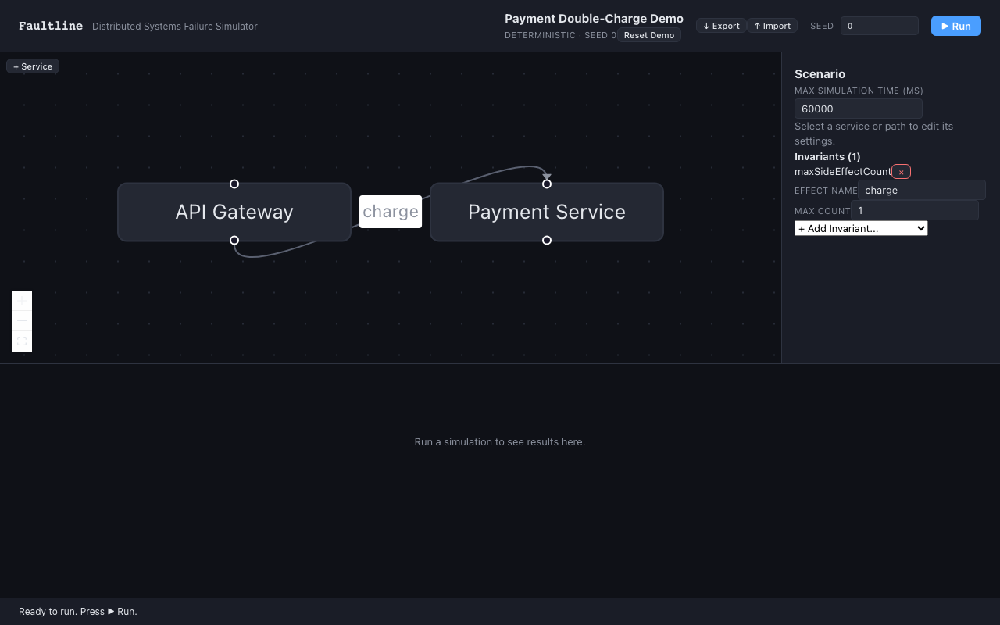
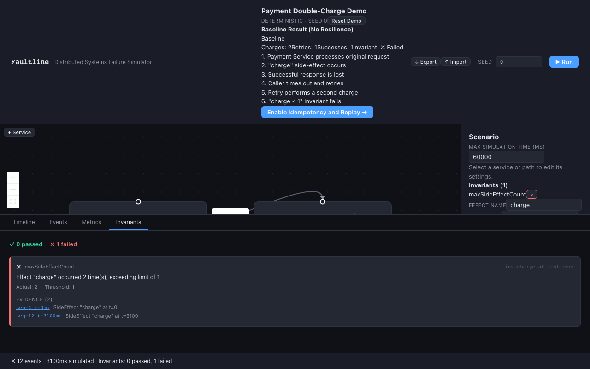
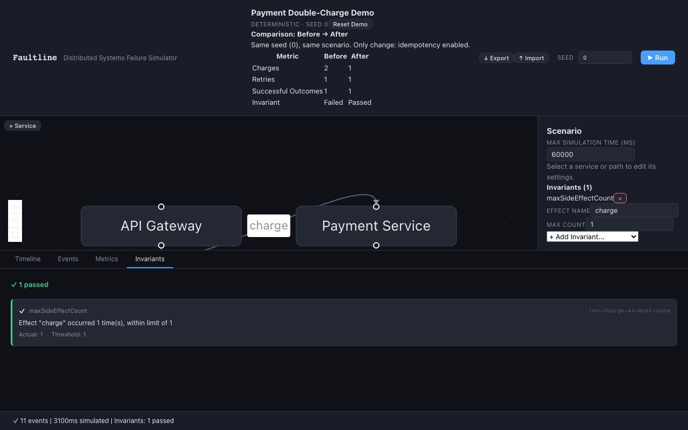

# Payment Double-Charge Demo Walkthrough

This walkthrough demonstrates Faultline's core value proposition: proving that resilience patterns protect correctness in distributed systems. The entire demo takes **< 30 seconds** from page load to validated result.

## The Problem

In distributed systems, network failures cause retries. Without idempotency, retries can duplicate side-effects — like charging a customer twice for the same order.

## Scenario Topology

```
API Gateway ──charge──▶ Payment Service
```

**Configuration:**

- Seed: `0` (deterministic)
- Failure: 50% probability of lost response
- Resilience: 1 retry, 100ms base delay, no jitter
- Invariant: `charge ≤ 1` (at most one charge side-effect)

---

## Step 1: Load the Baseline Scenario

Click **"Load Payment Demo"** on the home screen. The topology appears with:

- Two services: API Gateway → Payment Service
- One path configured with lost-response failure injection
- Idempotency **disabled**
- Seed locked to `0` for reproducibility



---

## Step 2: Run — Invariant Fails (Double Charge)

Click **"Run Simulation"**. With seed `0` and xoshiro128**:

1. Original request arrives at Payment Service → `charge` side-effect emitted
2. Response is **lost** (PRNG draw ≈ 0.262 < 0.5 threshold)
3. Caller times out → retry scheduled (100ms delay)
4. Retry arrives → second `charge` side-effect emitted
5. Invariant `charge ≤ 1` evaluates: **count = 2 → FAIL ❌**

The Invariants tab shows the failure with evidence pointing to the two charge events.



---

## Step 3: Enable Idempotency — Invariant Passes

Click **"Enable Idempotency"**. Faultline automatically re-runs with the same seed:

1. Original request arrives → `charge` side-effect emitted → response **cached**
2. Response is still lost (same PRNG draw with same seed)
3. Retry arrives → idempotency registry returns **cached response** (deduplicated)
4. **No second side-effect** — the retry is answered from cache
5. Invariant `charge ≤ 1` evaluates: **count = 1 → PASS ✅**



---

## What This Proves

| Without Idempotency            | With Idempotency             |
| ------------------------------ | ---------------------------- |
| Lost response triggers retry   | Same retry occurs            |
| Retry processes as new request | Retry hits idempotency cache |
| 2 charges emitted              | 1 charge emitted             |
| Invariant **FAILS** ❌         | Invariant **PASSES** ✅      |

The **same seed** guarantees the **same network conditions** in both runs. The only difference is whether the Payment Service's idempotency registry is enabled — isolating the resilience pattern as the single variable.

---

## Key Observations

### Determinism

Both runs use seed `0`. The PRNG draws identical values, meaning the same response is lost in both scenarios. This eliminates randomness as a confounding variable.

### Timeline View

The timeline swim-lane view shows:

- **Without idempotency:** Two `SideEffect("charge")` events on the Payment Service lane
- **With idempotency:** One `SideEffect("charge")` + one deduplicated `RequestArrived` (marked `deduplicated: true`)

### Metrics Comparison

| Metric                | Baseline | With Idempotency |
| --------------------- | -------- | ---------------- |
| Total requests        | 2        | 2                |
| Side-effects (charge) | 2        | 1                |
| Deduplications        | 0        | 1                |
| Lost responses        | 1        | 1                |

---

## Try It Yourself

1. Open the [live demo](https://taofiqq.github.io/faultline/)
2. Click "Load Payment Demo"
3. Click "Run Simulation" — observe the failure
4. Click "Enable Idempotency" — observe the fix
5. Change the seed — watch different loss patterns, same correctness guarantee

---

## Technical Details

The payment demo uses these engine components:

- **PRNG** (xoshiro128**): Determines which responses are lost
- **Failure Pipeline T3**: Applies lost-response failure based on PRNG draw
- **Retry Scheduler**: Schedules retry after timeout (100ms base delay)
- **Idempotency Registry**: Caches successful response, returns it for duplicate keys
- **Invariant Evaluator**: Counts `SideEffect("charge")` events, asserts ≤ 1

Source: [`src/scenario/demo-loader.ts`](../src/scenario/demo-loader.ts)
